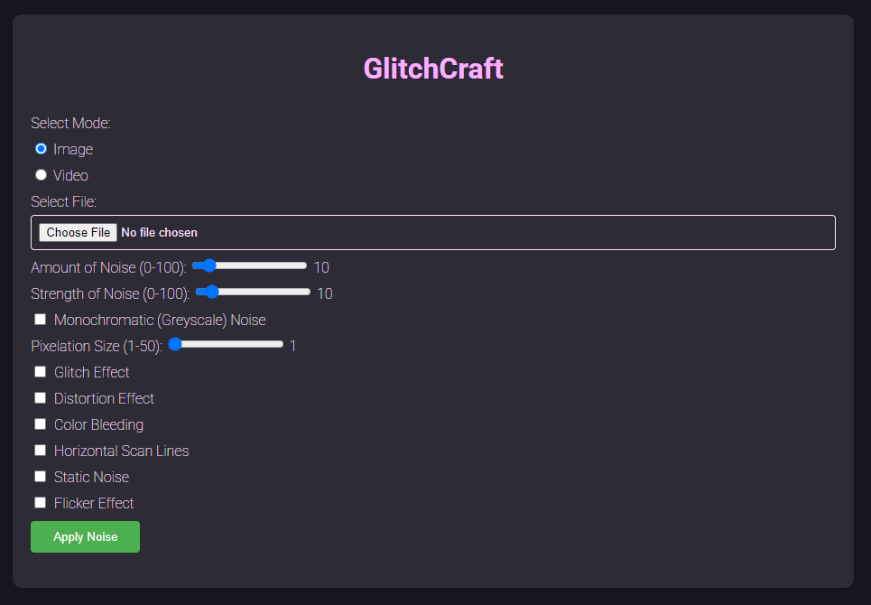

# GlitchCraft

This project is a Flask-based application that processes images and videos to add noise effects such as pixelation, glitch effects, distortions, and more. It also supports real-time video streaming and video re-encoding using FFmpeg.



## Features
- Apply various noise effects to images and videos.
- Real-time video processing with a preview feature.
- Support for multiple file types and formats.
- Automatic file cleanup for uploaded and generated files.

## Setup

### Prerequisites
- Python 3.8+
- FFmpeg installed on your system.

#### Installing FFmpeg
1. **Windows**:
   - Download FFmpeg from the official site: [https://ffmpeg.org/download.html](https://ffmpeg.org/download.html).
   - Add the FFmpeg binary to your system PATH:
     - Extract the FFmpeg folder.
     - Navigate to the `bin` directory and copy its path.
     - Add it to the PATH environment variable.
2. **macOS**:
   - Install using Homebrew:
     ```bash
     brew install ffmpeg
     ```
3. **Linux**:
   - Install via your package manager:
     ```bash
     sudo apt update
     sudo apt install ffmpeg
     ```

### Installation
1. Clone this repository:
   ```bash
   git clone <repository-url>
   cd <project-folder>
   ```
2. Install dependencies:
   ```bash
   pip install -r requirements.txt
   ```
3. Run the application:
   ```bash
   python app.python
   ```
   
### Usage
1. Access the app in your browser at `http://127.0.0.1:5000`.
2. Upload an image or video and apply noise effects using the interface.

### Considerations for FFmpeg
- **Functionality**: FFmpeg is used to re-encode videos for browser compatibility (H.264 encoding with `+faststart` for streaming).
- **Licensing**: FFmpeg is licensed under LGPL-2.1+ or GPL-2.0+, depending on how it is built. Ensure you comply with its license:
  - LGPL builds do not require derivative works to be licensed under GPL.
  - GPL builds may require any derivative work to comply with GPL terms.
- **Testing FFmpeg Installation**: To verify that FFmpeg is installed and available on your system, run:
  ```bash
  ffmpeg -version
  ```
  If you encounter issues, ensure FFmpeg is correctly installed and added to your system PATH.

### License
This project is licensed under the MIT License. See `LICENSE` for more details.
